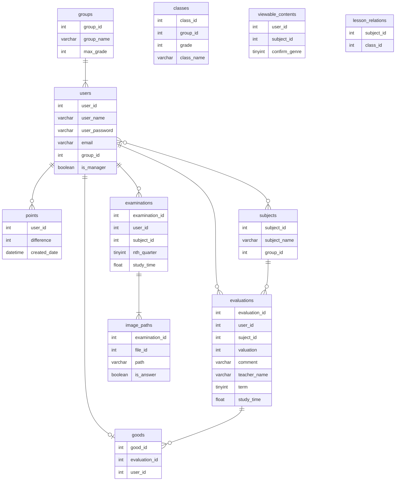

```mermaid
erDiagram
    groups {
        int group_id
        varchar group_name
        int max_grade
    }

    users {
        int user_id
        varchar user_name
        varchar user_password
        varchar email
        int group_id
        boolean is_manager
    }

    classes {
        int class_id
        int group_id
        int grade
        varchar class_name
    }

    points {
        int user_id
        int difference
        datetime created_date
    }

    viewable_contents {
        int user_id
        int subject_id
        tinyint confirm_genre
    }

    subjects {
        int subject_id
        varchar subject_name
        int group_id
    }

    evaluations {
        int evaluation_id
        int user_id
        int suject_id
        int valuation
        varchar comment
        varchar teacher_name
        tinyint term
        float study_time
    }

    examinations {
        int examination_id
        int user_id
        int subject_id
        tinyint nth_quarter
        float study_time
    }

    image_paths {
        int examination_id
        int file_id
        varchar path
        boolean is_answer
    }

    lesson_relations {
        int subject_id
        int class_id
    }

    goods {
        int good_id
        int evaluation_id
        int user_id
    }

    groups||--|{users: ""
    users||--o{points: ""
    users}o--o{subjects: ""
    users||--o{evaluations: ""
    users||--o{examinations: ""
    users||--o|goods: ""
    subjects||--o{evaluations: ""
    evaluations||--o{goods: ""
    examinations||--|{image_paths: ""
```