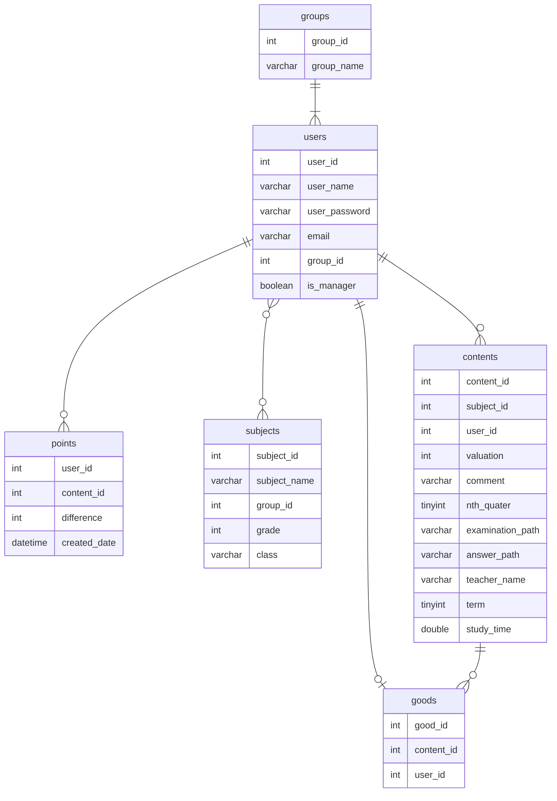

```mermaid
erDiagram
    groups {
        int group_id
        varchar group_name
    }

    users {
        int user_id
        varchar user_name
        varchar user_password
        varchar email
        int group_id
        boolean is_manager
    }

    points {
        int user_id
        int content_id
        int difference
        datetime created_date
    }

    subjects {
        int subject_id
        varchar subject_name
        int group_id
        int grade
        varchar class
    }

    contents {
        int content_id
        int subject_id
        int user_id
        int valuation
        varchar comment
        tinyint nth_quater
        varchar examination_path
        varchar answer_path
        varchar teacher_name
        tinyint term
        double study_time
    }

    goods {
        int good_id
        int content_id
        int user_id
    }

    groups||--|{users: ""
    users||--o{points: ""
    users}o--o{subjects: ""
    users||--o{contents: ""
    users||--o|goods: ""
    contents||--o{goods: ""
```